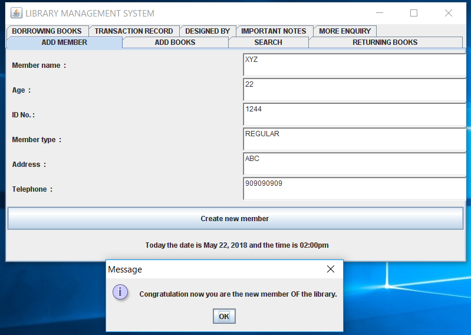
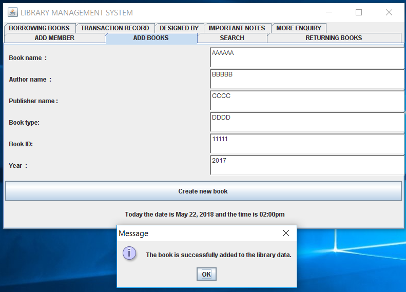
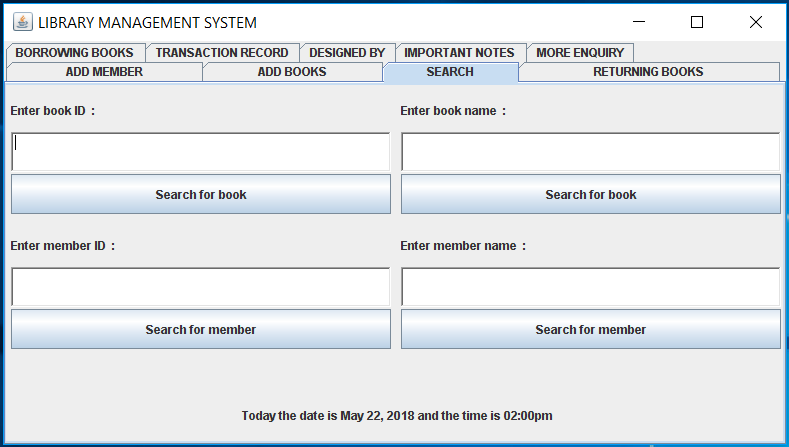

# Library Management System

 It is a library management system developed in JAVA using JDBC with single frame with multiple panels. which will be used to store the data into the database and also search the data from it. Oracle database is used here assuming the username "system" and password "system".

<h5> An image of the library management project while storing or successfully adding the member data.</h5>

<h5> An instance image while storing the book data into the library.</h5>

<h5> An instance image while searching the data for the book or member the member name or id and book name or id.</h5>
